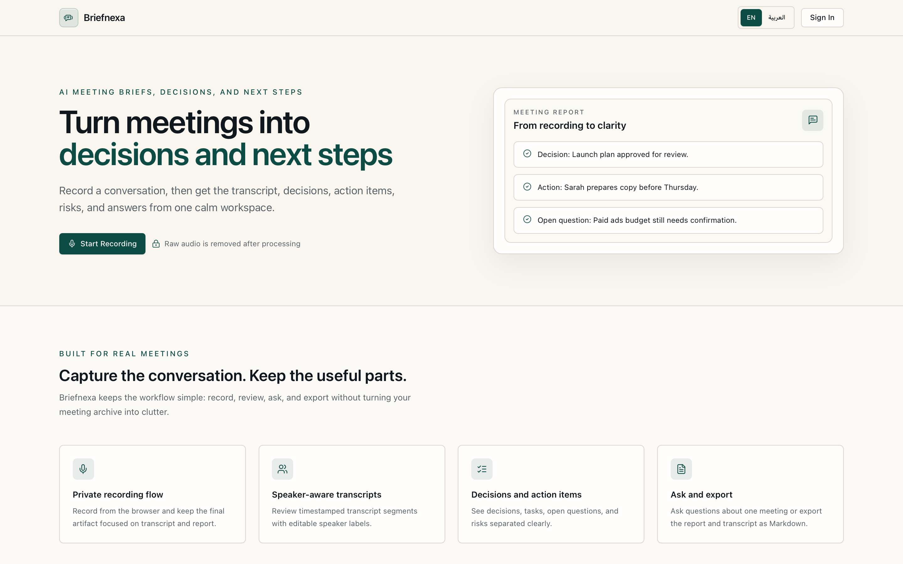
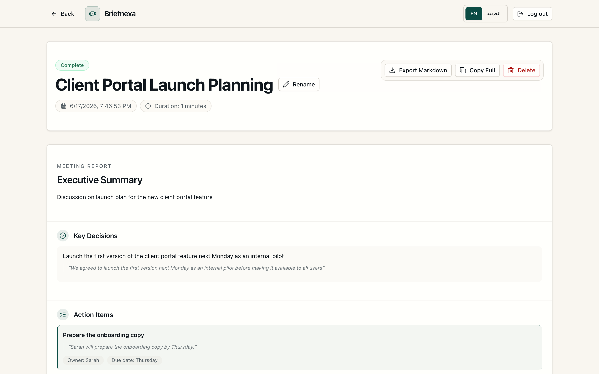
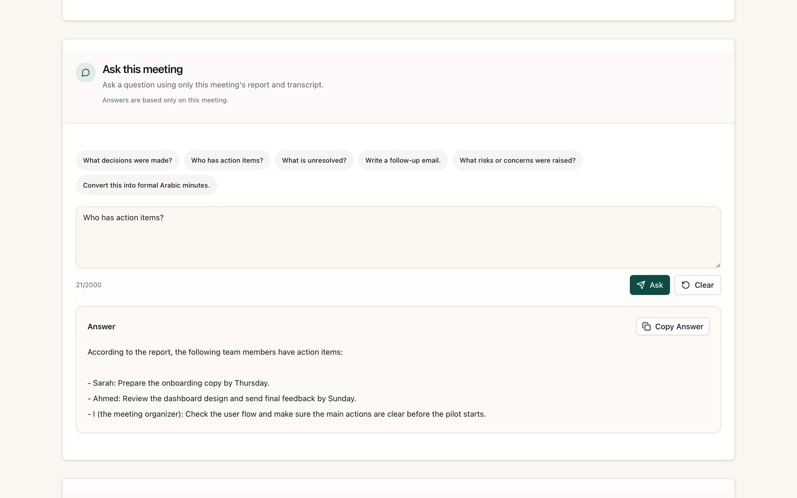
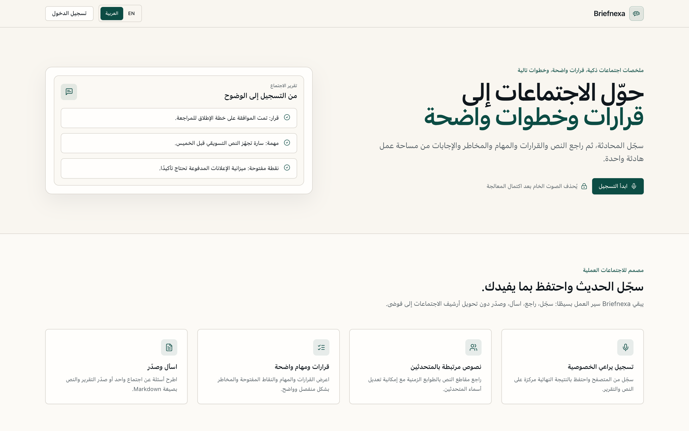
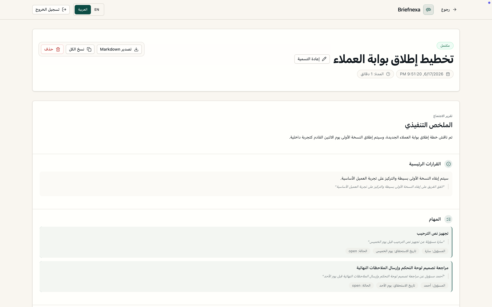
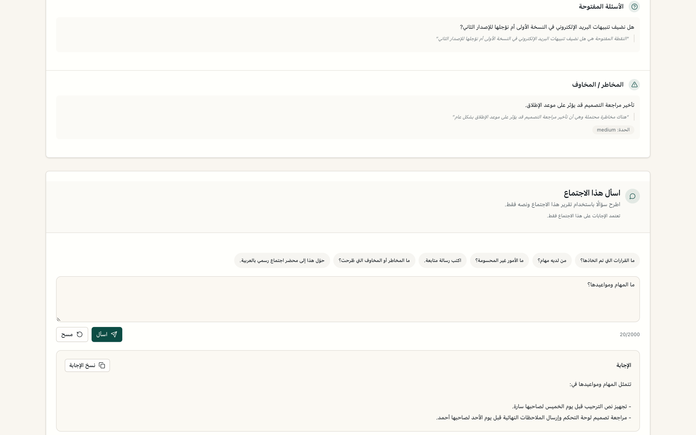

# Briefnexa

**AI meeting briefs, decisions, and next steps.**

Briefnexa is a privacy-focused AI meeting assistant MVP that turns recordings into transcripts, structured meeting reports, action items, and searchable meeting insights.

> This repository is a public showcase and case study. It intentionally does not include source code, backend implementation, frontend source files, database migrations, credentials, environment files, logs, signed URLs, private transcripts, real user data, or sensitive artifacts.

## Overview

Briefnexa helps users move from raw meeting audio to usable meeting knowledge. The MVP supports browser-based recording, audio upload, AI transcription, structured report generation, meeting search, and meeting-specific question answering.

The product is designed around a practical workflow: capture the meeting, process it into a transcript, generate a useful report, and make the result easy to search, copy, export, and revisit later.

Briefnexa also supports English and Arabic meeting workflows, including an Arabic RTL interface, Arabic meeting report presentation, and an Arabic Ask This Meeting experience.

## Problem

Meeting notes are often delayed, inconsistent, or incomplete. Important decisions, follow-ups, owners, due dates, risks, and open questions can be scattered across recordings, chats, and memory.

For bilingual users and Arabic-first teams, the problem is more specific: the product experience needs to work naturally in English and Arabic, including right-to-left layouts and Arabic meeting outputs.

## Solution

Briefnexa turns meeting recordings into structured, searchable meeting records. Instead of stopping at transcription, the MVP extracts the information people usually need after a meeting:

- executive summary
- key decisions
- action items with owners and due dates
- open questions
- risks and concerns
- meeting-specific answers through Ask This Meeting
- follow-up content that can be copied or exported

## Key features

- Browser-based meeting recording workflow
- Audio upload and processing
- AI transcription and speaker-aware transcript review
- Structured meeting reports with decisions, action items, open questions, and risks
- Ask-your-meeting interface for follow-up questions
- Export Markdown and copy workflows for summaries, transcripts, and reports
- Meeting dashboard with search, filters, rename, and delete actions
- English and Arabic meeting support, including RTL Arabic UI
- Arabic meeting report output and Arabic Ask This Meeting experience
- Privacy-oriented processing flow that removes raw audio after successful processing

## Bilingual Experience

Briefnexa is designed for real meeting workflows in both English and Arabic. The current showcase demonstrates an English experience and an Arabic experience, including RTL interface support, Arabic meeting reports, and Arabic meeting Q&A.

The goal is practical bilingual usability for users and teams who work across English and Arabic, not a generic translation feature.

## Screenshots

Primary showcase screenshots are embedded below. Additional screenshots are available in the [`screenshots/`](screenshots/) folder.

### English UI

| Landing | Meeting Report | Ask This Meeting |
| --- | --- | --- |
|  |  |  |

Additional English screenshots:

| Screen | File |
| --- | --- |
| Recording workflow | `screenshots/recording.png` |
| Dashboard | `screenshots/dashboard.png` |
| Report details | `screenshots/report-details.png` |

### Arabic UI

| Arabic Landing | Arabic Meeting Report | Arabic Ask This Meeting |
| --- | --- | --- |
|  |  |  |

## Tech stack

- React
- TypeScript
- Tailwind CSS
- Node.js / server-side TypeScript
- Supabase Auth
- Supabase Postgres
- Supabase Storage
- Groq Whisper transcription
- Groq LLM
- Render deployment

## Architecture overview

At a high level, the system follows this flow:

1. A user records a meeting in the browser or uploads audio.
2. The audio is uploaded for processing.
3. The server accesses the stored audio through controlled, signed server-side access.
4. The audio is transcribed using Groq Whisper.
5. The transcript is transformed into a structured meeting report using an LLM.
6. The transcript, report, metadata, and meeting state are stored in Supabase.
7. The user views the meeting detail page, searches meetings, exports Markdown, copies content, or asks questions about a specific meeting.
8. After successful processing, raw audio is automatically removed while the transcript and report remain available.

More details are available in [`docs/architecture.md`](docs/architecture.md).

## Privacy approach

Briefnexa treats raw audio as the most sensitive artifact. After processing completes successfully, the raw audio file is removed automatically. The transcript and structured report remain available because they provide the user-facing value of the product.

The MVP also includes log sanitization to avoid exposing signed URLs, storage keys, API keys, raw provider payloads, full transcripts, or private meeting content in logs.

More details are available in [`docs/privacy.md`](docs/privacy.md).

## What I built

I built the MVP end to end, including the recording experience, upload and processing flow, AI transcription pipeline, structured report generation, meeting detail UI, bilingual interface support, RTL handling, meeting management features, export/copy actions, and the Ask This Meeting experience.

The project combines product thinking, AI workflow design, privacy-aware handling of meeting artifacts, Arabic/English UX considerations, and practical full-stack implementation.

## Challenges solved

- Designed a useful output beyond plain transcription.
- Structured meeting content into decisions, tasks, risks, and open questions.
- Added bilingual English and Arabic UI support with RTL handling.
- Supported Arabic meeting reports and Arabic meeting-specific Q&A.
- Built a meeting-specific Ask flow for targeted questions.
- Improved privacy by removing raw audio after successful processing.
- Sanitized logs to reduce the risk of exposing sensitive processing details.
- Balanced an MVP implementation with a product workflow that can grow into a larger meeting intelligence tool.

## Current status

Briefnexa is currently an MVP and portfolio case study. The source code remains private because the project is actively being developed as a product.

## Roadmap

- Tasks dashboard
- Cross-meeting search
- Better speaker identification
- User privacy settings for retention
- Team and workspace support
- Calendar integrations
- More export formats

More details are available in [`docs/roadmap.md`](docs/roadmap.md).

## Notice about source code

This repository is a public showcase only. Source code, backend implementation, frontend source files, database migrations, credentials, API keys, environment files, logs, private transcripts, signed URLs, datasets, and real user data are intentionally not included.

See [`NOTICE.md`](NOTICE.md) for details.
